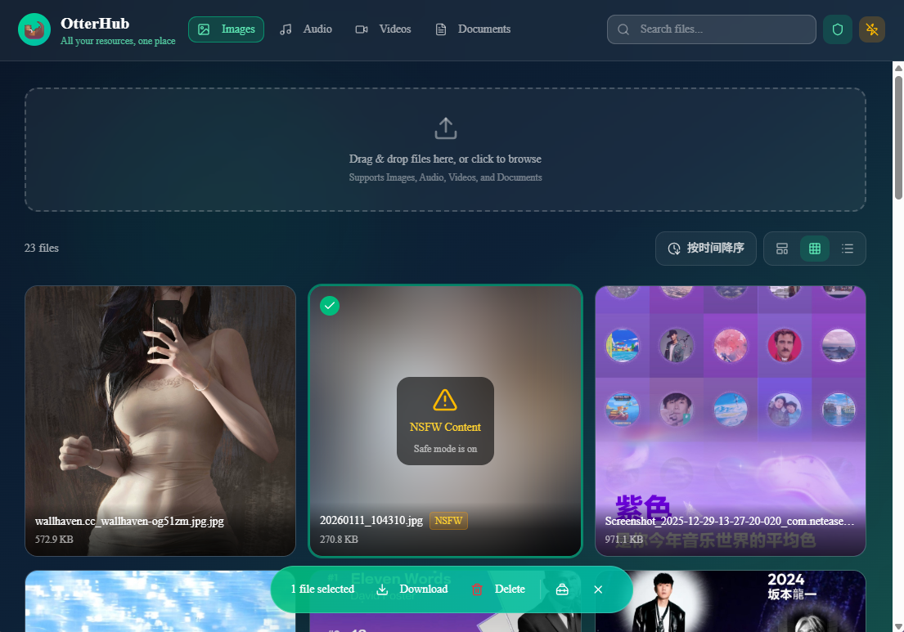

# OtterHub

<p align="center">
  
</p>
<p align="center"><strong>Stash your files like an otter</strong></p>

<p align="center">
  基于 Cloudflare KV + Telegram Bot API 的免费私人云盘
</p>

<p align="center">
  
  
  
  
</p>

---

## 👋 为什么有 OtterHub？

现有基于 **Cloudflare + Telegram** 的文件存储方案，例如：

- [Telegraph-Image](https://github.com/cf-pages/Telegraph-Image)
- [CloudFlare-ImgBed](https://github.com/MarSeventh/CloudFlare-ImgBed)

它们都很优秀，但要么偏向**图床与轻量分享**，要么为了通用性引入了**较高的复杂度**，并不完全适合**长期自用的私人云盘**。

### OtterHub 的定位

> 像水獭一样，把文件悄悄藏好，需要时再拿出来 🦦

OtterHub 是一个 **为个人使用场景定制** 的私人云盘方案：

- 基于 **Cloudflare Pages + KV**（最终一致性，上传后存在短暂同步延迟）
- 使用 **Telegram Bot** 作为实际文件存储（本地开发使用 R2）
- 通过 **分片上传** 突破 20MB 单文件限制
- 支持 **HTTP Range**，适合视频 / 大文件访问
- 架构克制、状态最小化，优先长期可维护性

它不追求"什么都支持"，而是专注于**刚好够用、稳定、好维护**。

> [!IMPORTANT]
> 体验站点：[OtterHub Demo](https://otterhub-demo.pages.dev/)
>
> 账号：`OtterHub` | 密码：`123456`
>
> 限制：演示站的默认文件不可删，仅支持上传 ≤20MB 文件（1 小时自动清理）



## ✨ 核心能力

- **私人文件存储**：
  - 支持图片 / 音频 / 视频 / 文档
  - KV Key 按类型划分前缀 `img:` `audio:` `video:` `doc:`，提升查询效率
  - 提供回收站功能（30天后自动清除），支持恢复和永久删除
- **大文件支持**：
  - 分片上传（≤20MB/片），已实测稳定上传并预览 **100MB** 文件，理论最大 1GB
  - 支持 HTTP Range，视频/音频按需加载，支持断点续传
- **实时预览**：
  - 通过文件 URL 直接打开，无需下载
  - 支持：图片 / 音频 / 视频 / 文本（txt、pdf 等）
- **可控性能与流量**：
  - 非 Range 请求走 Cloudflare Cache，Range 请求直出避免缓存污染
  - 图片加载策略：默认 / 省流（>5MB 不加载）/ 无图
- **安全与私密**：
  - 密码登录（基于 JWT + Cookie）
  - NSFW 图片客户端检测（nsfw.js），安全模式下自动遮罩
- **基础管理功能**：批量下载 / 删除，搜索 / 收藏 / 排序 / 标签
- **Telegram 频道上传**：频道 / 群内发送 ≤20MB 文件后自动注册到 OtterHub，并可回复直链
- **AI 图片分析**：网页端上传图片后可自动生成简要描述，便于图片检索（需配置 Workers AI binding，可在设置页关闭）
- **WebDAV 协议支持**：`/dav` 端点可挂载到 Windows 网络驱动器、macOS Finder、RaiDrive、Cyberduck、rclone 等客户端，像本地磁盘一样管理网盘文件

---

## 🚀 快速开始

### 前置要求

- Node.js 18+
- Cloudflare 账号（免费，部署需要）
- Telegram Bot Token（生产默认存储需要；本地开发默认不需要）

### 本地开发

1. **安装依赖**

   ```bash
   # 在根目录运行，自动安装所有 Workspaces 依赖
   npm install
   ```

2. **启动项目**

   ```bash
   npm run dev
   ```

   > 第一次启动需要构建前端 `npm run build`（生成 `frontend/out` 供 Wrangler Pages Dev 使用），后续启动直接 `npm run dev` 即可。

3. **访问网站**
   - 前端：`http://localhost:3000`
   - 后端：`http://localhost:8788` (由 Wrangler 代理)

> [!TIP]
> 开发环境下密码为`123456`，且采用本地 R2 存储，可以直接上传文件，方便调试。

### 提交前检查

项目使用 Husky + lint-staged 管理本地检查：

- commit 前：对 staged 文件运行 Prettier，并执行 `npm run typecheck`
- push 前：执行 `npm run build` 和 `npm run ci-test`

---

## 📦 Cloudflare 部署

### 1. 创建 Pages 项目

Fork 本项目，然后在 Cloudflare Dashboard 创建 Pages 项目：

- **构建命令**: `npm install && npm run build`
- **构建输出目录**: `frontend/out`

### 2. 配置环境变量

在 Pages 项目的设置中添加以下环境变量：

```env
PASSWORD=your_password          # 密码
TG_CHAT_ID=your_tg_chat_id      # Telegram Chat ID
TG_BOT_TOKEN=your_tg_bot_token  # Telegram Bot Token
API_TOKEN=your_api_token        # (可选) 用于 API 调用的 Token

# Telegram 频道/群组上传
TG_WEBHOOK_SECRET=your_secret   # 自定义 Webhook 校验密钥，建议 32 位以上随机字符串
```

> `TG_CHAT_ID` 和 `TG_BOT_TOKEN` 需在 Telegram 中获取。
> 💡 详细流程可参考：[Telegraph-Image](https://github.com/cf-pages/Telegraph-Image)

<details>
<summary>从 Telegram 频道/群组上传文件</summary>

**前置条件**

1. 在 Cloudflare Pages 环境变量中配置 `TG_WEBHOOK_SECRET`（建议 32 位以上随机字符串，用于校验 Webhook 请求来源）
2. Bot 会使用当前部署域名配置 Webhook，并在文件收录成功后回复直链

**配置步骤**

1. 将 Bot 加入目标频道 / 群，并授予**读取消息**和**发送消息**权限
2. 部署完成后进入 OtterHub 设置页 → 常规设置 → 上传设置
3. 点击「配置 Webhook」，再点击「检查状态」确认已绑定

**手动配置 Webhook（调试使用）**

```bash
# 1. 生成随机密钥（PowerShell 示例）
$SECRET = -join ((48..57) + (65..90) + (97..122) | Get-Random -Count 32 | % {[char]$_})
Write-Host "生成的密钥: $SECRET"

# 2. 先设置环境变量 TG_WEBHOOK_SECRET = $SECRET，然后调用 setWebhook
curl -X POST "https://api.telegram.org/bot<YOUR_BOT_TOKEN>/setWebhook" \
  -H "Content-Type: application/json" \
  -d "{\"url\":\"https://你的域名/telegram/webhook\",\"secret_token\":\"$SECRET\",\"allowed_updates\":[\"message\",\"channel_post\"]}"

# 3. 验证状态
curl "https://api.telegram.org/bot<YOUR_BOT_TOKEN>/getWebhookInfo"
```

> [!NOTE]
> **仅支持 ≤20MB 文件上传**，超过 20MB 的文件请使用 OtterHub 网页端上传以支持分片上传。

</details>

### 3. 绑定 KV Namespace

1. 在 Cloudflare Dashboard 创建 KV 命名空间 `oh_file_url`
2. 将 `oh_file_url` 绑定到 Pages 项目，变量名也设为 `oh_file_url`

### 4. （可选）绑定 Workers AI

如需启用图片自动分析功能：

1. 进入 Pages 项目 -> **Settings -> Functions -> AI Bindings**
2. 点击「Add binding」，**变量名填 `AI`**，选择默认 Workers AI 资源

> 该功能默认启用，可在 OtterHub 设置页 -> 常规设置 -> 上传设置中关闭。

### 5. 重新部署

回到部署页面重试部署，让环境变量和 KV 绑定生效。

---

## 📁 WebDAV 使用指南

OtterHub 内置标准 WebDAV 服务端（等级 1/2），部署后即可将网盘挂载为本地磁盘。

### 连接信息

| 项目     | 值                                 |
| -------- | ---------------------------------- |
| 服务地址 | `https://<你的域名>/dav/`          |
| 用户名   | 任意（如 `admin`）                 |
| 密码     | 登录密码 `PASSWORD` 或 `API_TOKEN` |

### 客户端配置示例

**Windows（映射网络驱动器）**：此电脑 → 映射网络驱动器 → 文件夹填 `https://<域名>/dav/` → 输入密码勾选"使用其他凭据"。

**macOS Finder**：前往 → 连接服务器（⌘K）→ 输入 `https://<域名>/dav/` → 选择"注册用户"输入密码。

**rclone**：

```bash
rclone config
# 类型选 webdav，url = https://<域名>/dav
# vendor = other，user = admin，pass = 登录密码
rclone ls remote:img          # 列出图片
rclone copy ./movie.mp4 remote:video/
```

**RaiDrive / Cyberduck / Mountain Duck**：协议选 WebDAV(HTTPS)，地址填域名，路径 `/dav`，密码同上。

### 目录结构与操作

- 虚拟目录按文件类型划分：`/img`、`/video`、`/audio`、`/doc`
- 支持的操作：
  - 浏览：`PROPFIND`（Depth 0/1）
  - 上传：`PUT`（≤20MB 直传，>20MB 自动分片，单文件上限 1GB）
  - 下载：`GET` / `HEAD`（支持 HTTP Range 断点续传，与网页端缓存互通）
  - 重命名 / 移动：`MOVE`（同目录为重命名；跨目录移动仅重命名，文件仍归属原类型目录，但可通过新路径访问）
  - 复制：`COPY`（读取源文件后重新写入，大于 20MB 自动分片）
  - 删除：`DELETE`（移入回收站，可在网页端恢复，30 天后自动清除）
  - 锁：`LOCK` / `UNLOCK`（兼容性假锁，保证 Windows 客户端可写入）
  - 属性：`PROPPATCH`（接受请求但属性不持久化）

### 注意事项

- **无法创建文件夹**：目录是按文件类型虚拟生成的（`MKCOL` 返回 405），与网页端的类型分栏保持一致
- **权限**：WebDAV 拥有与登录密码同等的全部权限（包括删除私有文件），请妥善保管密码；建议客户端走 HTTPS
- **覆盖上传**：同名文件再次 PUT 会把旧文件移入回收站后写入新文件
- **兼容性**：已通过 43 项 E2E 测试（认证 / PROPFIND / PUT / GET / Range / 21MB 分片 / MOVE / COPY / 中文文件名 / LOCK 等），见 `test/webdav.js`

---

## 🔧 技术原理

### 文件上传

> 以大文件分片上传流程为例

1. **初始化上传**
   - 前端发送 `POST /upload/chunk/init` 请求
   - 以 JSON 携带文件类型、名称、大小、总分片数和默认标签
   - 后端创建最终 KV，返回唯一文件 key

2. **分片上传**
   - 前端将文件分片（每片 ≤ 20MB）
   - 携带 key 逐个发送 `POST /upload/chunk`
   - 后端将分片暂存到临时 KV（TTL = 1 小时，value ≤ 25MB）

3. **异步上传到 Telegram**
   - 使用 `waitUntil` 异步上传分片到 Telegram
   - 上传成功后获取 file_id

4. **合并完成**
   - 将 file_id 存入最终 KV 的 chunks 数组
   - 更新 uploadedIndices 元数据
   - 删除临时 KV

### 文件下载

> 以大文件流式获取流程为例

1. **读取元数据**
   - 从 KV 读取文件元数据和分片信息
   - 解析 chunks 数组中的 file_id

2. **流式拉取**
   - 从 Telegram API 流式拉取所有分片
   - 支持 HTTP Range 请求
   - 边拉取边返回给客户端

3. **断点续传**
   - 支持 Range 请求头
   - 可指定下载指定字节范围

### 数据存储结构

> 以 30MB 文件为例

#### KV Key + Metadata 结构

```json
{
  "name": "video:chunk_7yHZkP0bzyUN5VLE.mp4",
  "metadata": {
    "fileName": "示例视频-1080P.mp4",
    "fileSize": 30202507,
    "uploadedAt": 1768059589484,
    "liked": false,
    "chunkInfo": {
      "total": 2,
      "uploadedIndices": [1, 0]
    }
  }
}
```

#### KV Value 结构（chunks 数组）

```json
[
  {
    "idx": 1,
    "file_id": "BQACAgUAAyEGAASJIjr1AAIDa2lictGSBOJ24LnypIN5JCmV2u77AAJ_HwAC...",
    "size": 9230987
  },
  {
    "idx": 0,
    "file_id": "BQACAgUAAyEGAASJIjr1AAIDbGlictIJ9om0qQ66ZW4GssRXCARUAAKAHwAC...",
    "size": 20971520
  }
]
```

#### 存储容量分析

- **单文件占用**：< 500 字节（key + metadata + value 结构）
- **KV 总容量**：1GB（免费版）
- **理论存储数量**： **≥ 200万个**

> 计算公式：`1GB / 500字节 ≈ 200万`

---

## ❓ 常见问题

<details>
<summary>1. 上传完成后立即查看，为什么文件不完整？</summary>

上传过程使用了 `waitUntil` 进行异步处理，
在分片尚未全部上传完成前，文件可能暂时显示不完整。

通常只需 **稍等片刻并刷新页面** 即可正常显示。

</details>

<details>
<summary>2. Telegram 单文件限制 20MB，OtterHub 如何支持大文件？</summary>

通过 **分片上传 + 流式合并** 实现：

- 前端将文件拆分为多个 ≤20MB 的分片
- 每个分片独立上传到 Telegram
- 服务端记录分片 `file_id`
- 下载时按顺序流式拉取并合并

👉 当前最大支持 **1GB 文件（50 × 20MB）**。

</details>

<details>
<summary>3. Cloudflare Workers 免费版是否够用？</summary>

对于**个人存储场景**通常足够，**理论存储数量**： **≥ 200万个**
但大文件上传会占用较多内存和CPU资源，**不建议并发上传多个大文件**。

> 具体限制参考官方文档：https://developers.cloudflare.com/workers/platform/limits/

</details>

<details>
<summary>4. 如何获取 Telegram Bot Token 和 Chat ID？</summary>

以下为 AI 生成，详细流程可参考：[Telegraph-Image](https://github.com/cf-pages/Telegraph-Image)

**Bot Token**

1. 在 Telegram 搜索 `@BotFather`
2. 发送 `/newbot`
3. 保存返回的 Token

**Chat ID**

- 搜索 `@userinfobot` 并发送任意消息
- 或访问：
  `https://api.telegram.org/bot<YOUR_BOT_TOKEN>/getUpdates`
  </details>

---

## 📂 项目结构

```
OtterHub/
├── frontend/           # Next.js Frontend
│   ├── lib/
│   │   ├── api/        # Hono RPC Client (Type-safe)
│   │   │   ├── client.ts # RPC Client Instance
│   │   │   └── ...
│   └── ...
├── functions/          # Cloudflare Pages Functions (Hono Backend)
│   ├── routes/         # 业务路由模块
│   │   ├── file/       # 文件操作
│   │   ├── upload/     # 上传逻辑
│   │   ├── wallpaper/  # 壁纸服务
│   │   └── ...
│   ├── middleware/     # 中间件 (Auth, CORS)
│   ├── utils/          # 工具库
│   │   ├── db-adapter/ # 存储适配器 (Telegram/R2)
│   │   ├── proxy/      # 代理
│   │   └── ...
│   ├── routes/telegram # Telegram Webhook 导入与配置
│   ├── app.ts          # Hono App 定义 & AppType 导出
│   └── [[path]].ts     # Pages Functions 入口
├── shared/             # 前后端共享类型/工具 (Workspaces)
├── test/               # 基础端到端测试 (mocha)
├── public/             # 静态资源
├── package.json        # Monorepo 配置
├── wrangler.jsonc      # Wrangler 配置（本地开发/静态资源）
└── README.md
```

---

## 🔍 参考资料

- [Cloudflare API](https://developers.cloudflare.com/api)
- [Telegram Bot API](https://core.telegram.org/bots/api)
- [Telegraph-Image](https://github.com/cf-pages/Telegraph-Image) - CF + TG 文件存储方案来源
- [CloudFlare-ImgBed](https://github.com/MarSeventh/CloudFlare-ImgBed) - DB 适配器 & 分片上传设计的灵感来源

---

## 📋 TODO

- [x] 核心能力
  - [x] 基于 Cookie 实现密码登录、登出功能
  - [x] 分片上传（≤20MB / 片），支持大文件（已实测 100MB，理论 1GB）
  - [x] Telegram 频道 / 群上传导入（Webhook 注册 ≤20MB 文件的 `file_id`）
  - [x] HTTP Range 支持（视频 / 音频按需加载、断点续传）
  - [x] Private 私有文件访问控制
  - [x] 回收站功能（支持恢复 / 永久删除 / 自动清理）

- [x] 文件管理
  - [x] 分页获取文件列表
  - [x] 批量操作（复制 / 删除 / 重命名）
  - [x] 收藏（Liked）和标签（Tag）
  - [x] 筛选功能（按标签 / 按收藏 / 按日期范围）和排序功能（文件大小 / 文件名称 / 上传时间）
  - [x] 临时分享文件（无论是否 Private 都可以访问）
    - [x] KV实现, 永久 / 有效期 URL （允许用户选择）
    - [x] key: `share:<uuid>`
    - [x] value: 单文件或打包分享信息

- [x] 预览与展示
  - [x] 图片瀑布流（支持 GIF）
  - [x] 视频缩略图（Telegram thumbnail），仅 20MB 内的视频文件支持
  - [x] 纯文本文件预览（TXT / MD / JSON 等）
  - [x] 图片加载策略（默认 / 省流 / 无图）

- [x] 安全与体验
  - [x] 日夜模式
  - [x] 移动端基础适配
  - [x] NSFWJS 客户端检测（安全模式遮罩）
  - [x] 右下角悬浮按钮（FAB），多操作统一入口（登出、管理页面、回收站）
  - [x] AI 图片分析

---

### Low Priority

- [x] 随机壁纸获取（Wallhaven、Bing、Pixabay 等）
- [x] API Token 支持 (通过 `API_TOKEN` 环境变量配置)
- [ ] 申请 TG API ID，自建 Telegram Bot API Server, 单个文件下载上限可提升至 2GB
- [ ] ~~TG Webhook 上传同步文件标签~~（会额外消耗一次 KV 读取额度）

- [ ] KV vs D1 数据库评估
  - D1：单库 500MB，分库可达 5GB
  - 优点：SQL、关系模型、文件夹结构更自然
  - 当前结论：KV 足够，暂不迁移
- [ ] ~~文件夹系统~~ （已通过「文件名前缀 + 搜索 + Tag」实现等效能力）

---

## 🤝 Contributing

欢迎提交 **Issue** 反馈问题或建议新功能，也欢迎 **Pull Request** 一起完善项目！
觉得有用的话，点个 ⭐️ 支持一下吧！
